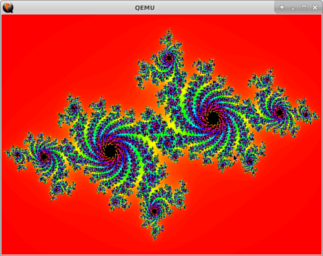

## UEFI Funny cartoons

Demo project.
We insert additional submenus into the EDK2 OVMF.

### Download

```
$ git clone <path to this repo>
$ git submodule update --init --recursive 
```
### Install dependencies

```
$ sudo apt-get install build-essential subversion uuid-dev iasl qemu
```

### Build

OS: Ubuntu 18.04 gcc 7.5.0

At first time (only required once):
```
$ cd ./uefi_cartoons/3rdparty/edk2
$ . ./edk_setup.sh
$ make -C ./BaseTools
```
Regular assembly:
```
$ cd ./uefi_cartoons/3rdparty/edk2
$ ../../source/OvmfCartoonsPkg/build.sh -a X64
    or
$ ../../source/OvmfCartoonsPkg/build.sh -a X64 -b RELEASE
```

### Run in QEMU

[See](https://github.com/tianocore/tianocore.github.io/wiki/How-to-run-OVMF)

```
$ mkdir -p ~/run-ovmf
$ cd ~/run-ovmf
$ mkdir -p ./hda-contents
```

Copy build image from ```uefi_cartoons/3rdparty/edk2/Build/OvmfX64/DEBUG_GCC5<or RELEASE_GCC5>/FV/OVMF.fd``` 
to running directory ```~/run-ovmf```

```
$ cp <path to repo>/3rdparty/edk2/Build/OvmfX64/DEBUG_GCC5<or RELEASE_GCC5>/FV/OVMF.fd ~/run-ovmf/bios.bin
```

Run qemu:

```
$ qemu-system-x86_64 -pflash bios.bin -hda fat:rw:hda-contents -net none
```
In the emulator window, select sequentially (after exit from uefi shell) 
```Device Manager -> Funny Cartoons ...```
Next, choose any menu from the available
After show, press any key to return.

### Screenshots

Fractal      |  Doom Fire   
-------------| --------------                        
 |  


